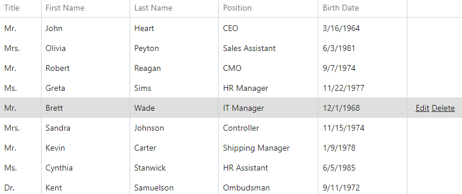

<!-- default badges list -->

[](https://supportcenter.devexpress.com/ticket/details/T358945)
[](https://docs.devexpress.com/GeneralInformation/403183)
[](#does-this-example-address-your-development-requirementsobjectives)
<!-- default badges end -->
# DataGrid for DevExtreme - How to show command buttons only when a row is hovered/selected

This example demonstrates how to show command buttons only when a row is hovered/selected.

The DataGrid is configured with the [hoverStateEnabled](https://js.devexpress.com/Documentation/ApiReference/UI_Components/dxDataGrid/Configuration/#hoverStateEnabled) property and single-mode [selection](https://js.devexpress.com/Documentation/ApiReference/UI_Components/dxDataGrid/Configuration/selection/). The following CSS hides command-column links and reveals them only for hovered or selected rows:

```css
.dx-command-edit .dx-link {
  visibility: hidden;
}

.dx-state-hover .dx-command-edit .dx-link,
.dx-selection .dx-command-edit .dx-link {
  visibility: visible;
}
```



## Files to Review

- **jQuery**
    - [index.js](jQuery/src/index.js)
    - [index.css](jQuery/src/index.css)
- **Angular**
    - [app.component.html](Angular/src/app/app.component.html)
    - [app.component.scss](Angular/src/app/app.component.scss)
- **Vue**
    - [HomeContent.vue](Vue/src/components/HomeContent.vue)
- **React**
    - [App.tsx](React/src/App.tsx)
    - [App.css](React/src/App.css)
- **ASP.NET Core**
    - [Index.cshtml](ASP.NET%20Core/Views/Home/Index.cshtml)

## Documentation

- [DataGrid - API Reference](https://js.devexpress.com/Documentation/ApiReference/UI_Components/dxDataGrid/)
<!-- feedback -->
## Does This Example Address Your Development Requirements/Objectives?

[](https://www.devexpress.com/support/examples/survey.xml?utm_source=github&utm_campaign=devextreme-datagrid-show-command-buttons-only-when-row-is-hovered-or-selected&~~~was_helpful=yes) [](https://www.devexpress.com/support/examples/survey.xml?utm_source=github&utm_campaign=devextreme-datagrid-show-command-buttons-only-when-row-is-hovered-or-selected&~~~was_helpful=no)

(you will be redirected to DevExpress.com to submit your response)
<!-- feedback end -->
