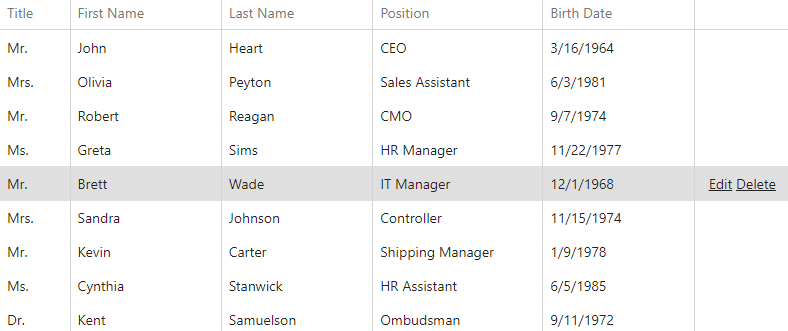

<!-- default badges list -->

<!-- default badges end -->

# DataGrid for DevExtreme - How to show command buttons only when a row is hovered/selected
This example demonstrates how to show command buttons only when a row is hovered/selected. 

## Files to Review

- **JS**
    - [Index.html](./JS/Index.html)

## Documentation

- [DataGrid - API Reference](https://js.devexpress.com/Documentation/ApiReference/UI_Components/dxDataGrid/)
<!-- feedback -->
## Does this example address your development requirements/objectives?

 

(you will be redirected to DevExpress.com to submit your response)
<!-- feedback end -->
